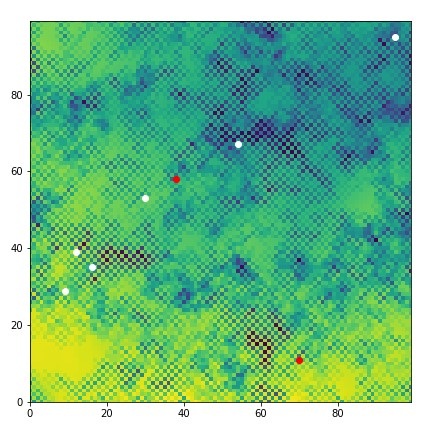

# Agent Based Modelling

## The Task

I am currently learning Python as part of a Geographical Information Science Masters degree through the University of Leeds.  Our coding skills need to have a spatial application, and hence we were tasked with creating of an agent based model which contained three principal elements:
1.  Some 'agents'
2.  An environment within which the agents exist
3.  A model which allows the agents to interact with each other

## My solution

### 1. Agents

I created two agent classes - sheep and wolves. These were established with a set of characteristics and functions as required by their actions within the programme - such as randomly generated x and y coordinates and the ability to move around their environment.  Sheep were given the ability to 'eat' their environment and to share stores with each other, whilst wolves were given the ability to eat sheep that came within a set distance.  In order to allow interaction between agents I also included Pythagorean distance calculations.

The code can be viewed in [agentframework.py](https://github.com/geocoder21/githubintro/blob/main/agentframework.py)

### 2. The environment

The environment within which the agents exist is imported through a csv reader.  The dataset is organised into float values within rows, effectively creating a grid with a value for each square.  I also included a function to write out an output csv file for the updated environment, once the values had been 'eaten' as the model runs.

The code can be viewed in [Environment.py](https://github.com/geocoder21/githubintro/blob/main/Environment.py)

### 3. The model

The model is organised into imports, parameters, functions, and then the main programme.  
- The imports include the agentframework file (containing agent classes) and Environment file.  
- N.B. The model has been set up for 10 sheep and 2 wolves, with 100 iterations, but this can be adjusted for different results.

The update function moves the sheep and wolves at random.  The sheep eat the environment and share with neighbours, whereas the wolves eat the sheep.  The results are plotted and animated with a scatterplot.  In my code sheep are represented by white dots and wolves by red dots.  

The main programme obtains starting coordinate data for the sheep from a webpage, using BeautifulSoup to extract x and y classes.  Wolf starting positions are created in a similar manner, but adding the number of sheep to coordinate data to prevent duplication with sheep positions.  The programme initiates a Graphical User Interface in order to run the model.  The run command starts the animation for the set number of iterations.  As the model runs the number of remaining sheep is printed.  Finally the updated environment is written out as a csv file.

There are two versions of the model in the repository:
- a version with set input parameters [model_simple.py](https://github.com/geocoder21/githubintro/blob/main/model_simple.py)
- a version with sliders, allowing the user to define starting parameters [model_sliders.py](https://github.com/geocoder21/githubintro/blob/main/model_sliders.py)

Below is a screenshot of the plot after the model has run: in this instance there were 6 sheep left when the model completed.

## Code repository

[The repository can be found here](https://github.com/geocoder21/githubintro)

The code was developed using Spyder but could be run using any Python IDE.

### Repository contents
<pre>
- model_simple.py          <i> Model - with preset parameters </i>
- model_sliders.py         <i> Model - with user input parameters </i>
- agentframework.py        <i> Agent class code </i>
- Environment.py           <i> Environment code </i>
- in.txt                   <i> Environment data in csv format </i>
- Readme.md                <i> This document </i>
- Development.md           <i> Development of the model and further ideas</i>
- License                  <i> MIT license </i>
</pre>
